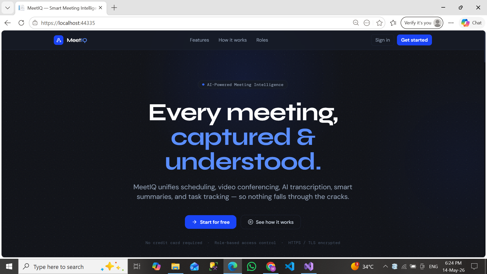
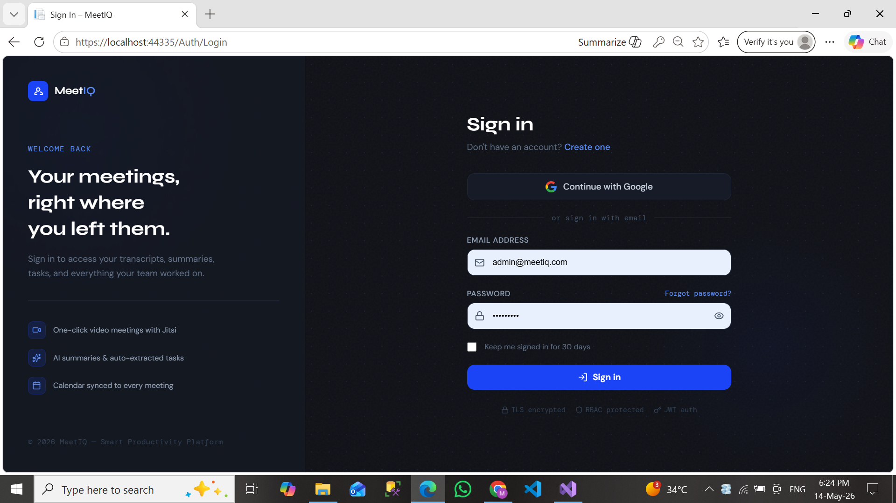
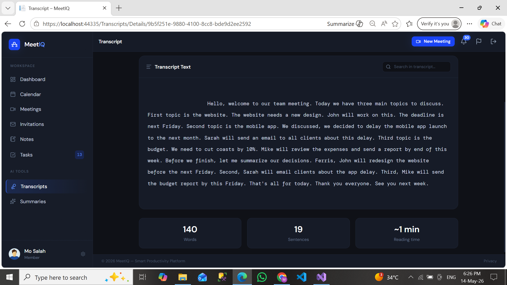
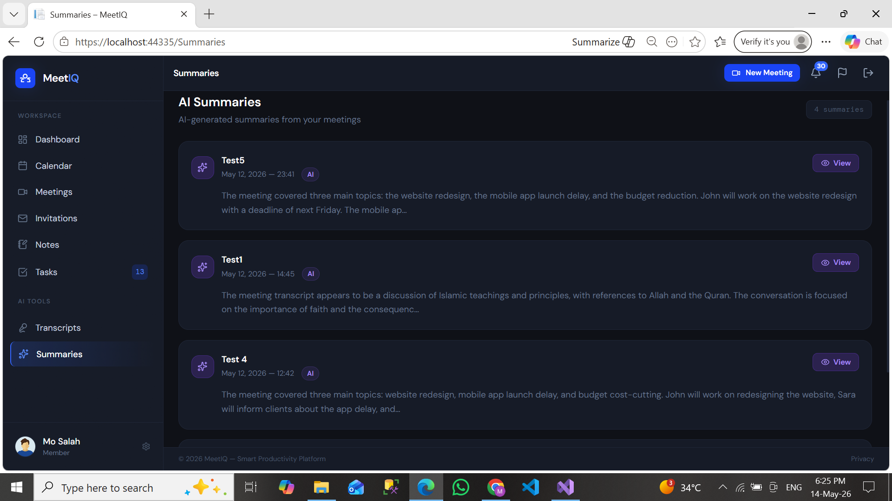
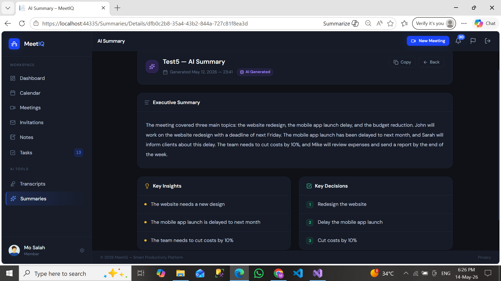
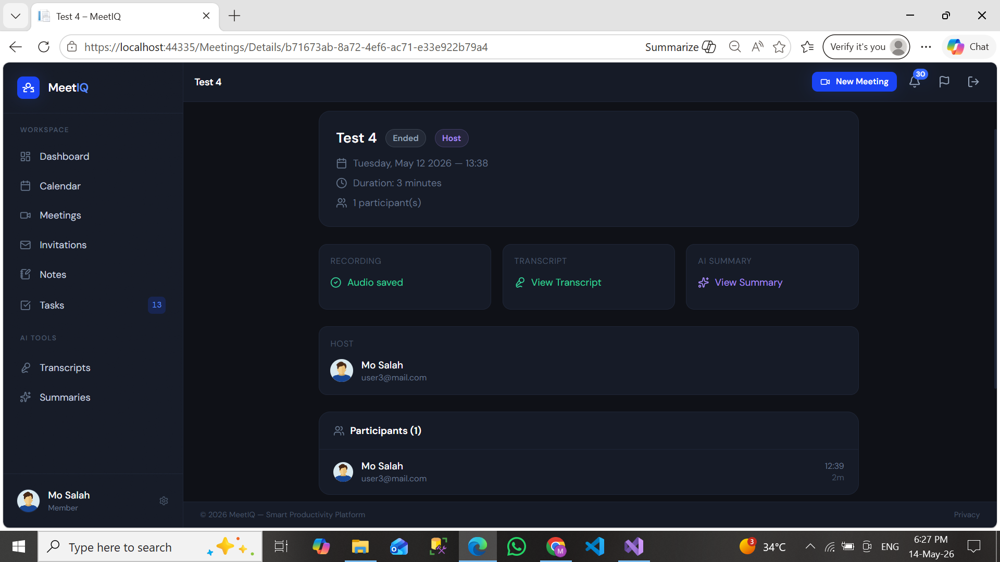
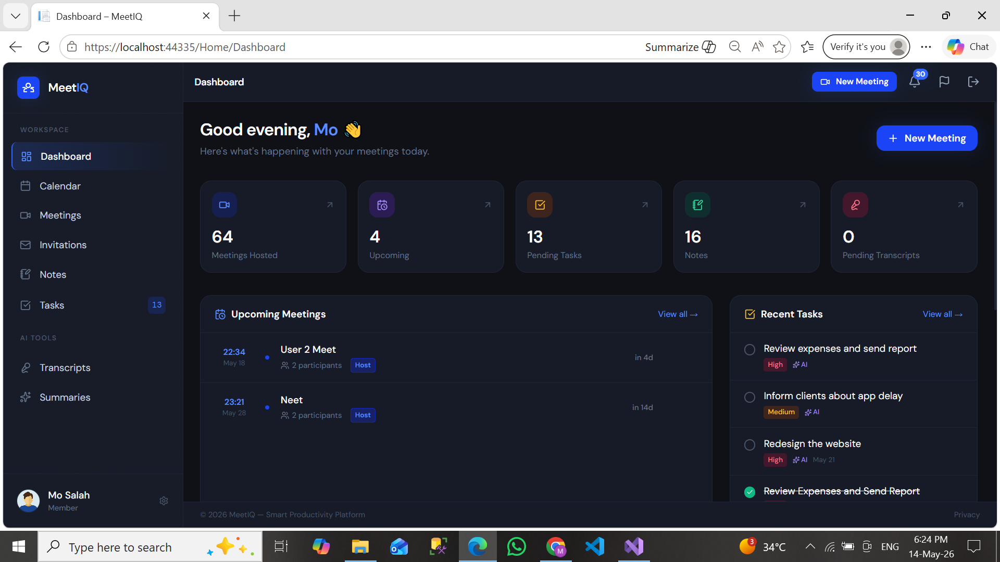
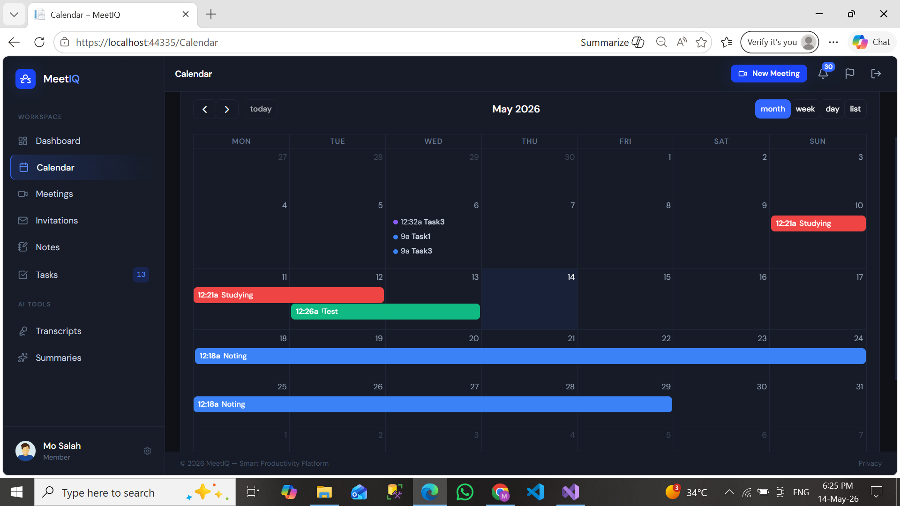
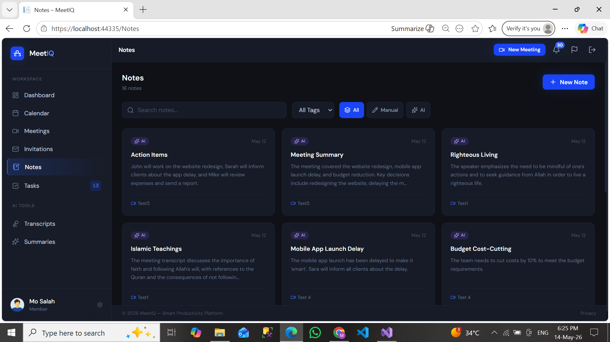
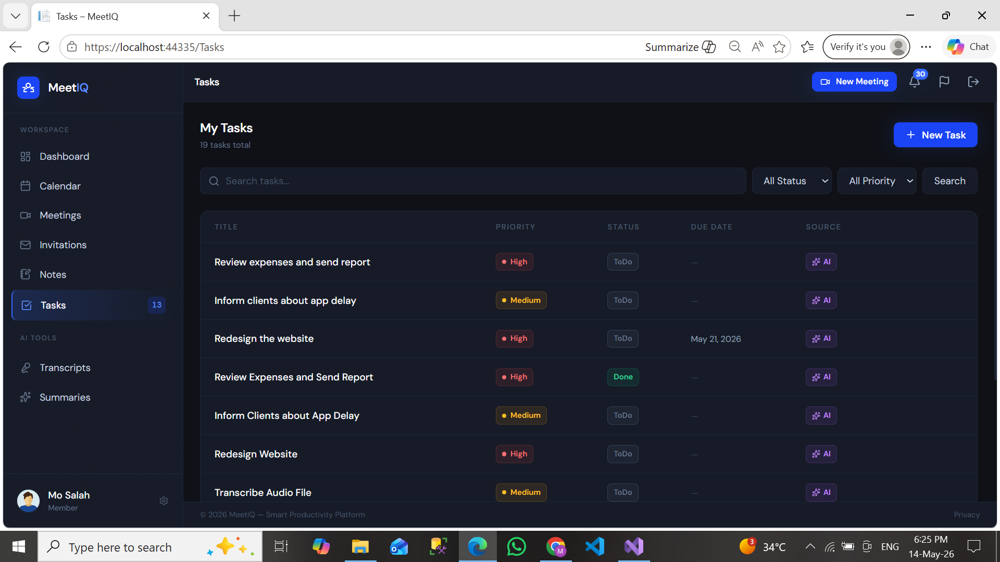

# MeetIQ 🧠
### AI-Powered Smart Meeting & Collaboration Platform

> Transform every meeting into structured, searchable, and actionable organizational knowledge — automatically.

---

## 📌 Overview

**MeetIQ** is a full-stack enterprise productivity platform that automates the entire meeting lifecycle. From scheduling and video conferencing to AI transcription, smart summarization, and task extraction — MeetIQ centralizes everything in one unified environment.

Built as a graduation project, the system demonstrates enterprise-level software engineering through Clean Architecture, CQRS, real-time communication, background job processing, and an AI automation pipeline.

---

## ✨ Key Features

- **AI Transcription** — Automatic speech-to-text via Whisper
- **AI Summarization** — Meeting summaries, key decisions & action items via Groq (LLaMA 3.3)
- **Human-in-the-Loop Approval** — Users review, edit, and approve AI-generated content before saving
- **Video Conferencing** — Integrated Jitsi Meet rooms
- **Real-Time Notifications** — Live updates via SignalR
- **Calendar & Scheduling** — Full event and meeting scheduling system
- **Notes System** — Rich-text notes with tagging, search, and meeting linking
- **Task Management** — AI-generated and manual tasks with priorities and status tracking
- **Google OAuth** — One-click sign-in via Google
- **Admin Dashboard** — User management, feedback tracking, and Hangfire job monitoring

---

## 🏗️ Architecture

MeetIQ follows **Clean Architecture** with strict layer separation:

```
┌─────────────────────────────────────────┐
│           Presentation Layer            │
│     ASP.NET MVC · Razor · SignalR Hub   │
├─────────────────────────────────────────┤
│           Application Layer             │
│   CQRS (Commands & Queries) · MediatR   │
│        DTOs · Validation · Services     │
├─────────────────────────────────────────┤
│             Domain Layer                │
│   Entities · Business Rules · Enums     │
│          Interfaces · Contracts         │
├─────────────────────────────────────────┤
│          Infrastructure Layer           │
│  EF Core · Dapper · SQLKata · Hangfire  │
│       AI Services · External APIs       │
└─────────────────────────────────────────┘
```

### Design Patterns Used

| Pattern | Purpose |
|---|---|
| **Clean Architecture** | Full separation of concerns across 4 layers |
| **CQRS** | Separate read/write models for performance and clarity |
| **Repository Pattern** | Abstracted data access |
| **Mediator (MediatR)** | Decoupled command/query dispatching |
| **Background Jobs (Hangfire)** | Async processing for AI and notifications |

---

## ⚙️ Technical Stack

### Backend
| Technology | Role |
|---|---|
| ASP.NET Core MVC | Web framework |
| Entity Framework Core | ORM for write operations |
| Dapper + SQLKata | High-performance read queries |
| MediatR | CQRS mediator |
| SignalR | Real-time WebSocket communication |
| Hangfire | Background job processing & scheduling |
| ASP.NET Core Identity | Authentication & role management |

### Frontend
| Technology | Role |
|---|---|
| Razor Views | Server-side rendering |
| Tailwind CSS | Utility-first styling |
| JavaScript | Client-side interactivity |
| Lucide Icons | Icon system |

### Database
| Technology | Role |
|---|---|
| SQL Server | Primary relational database |
| EF Core Migrations | Schema management |
| Database Indexing | Query performance optimization |

### AI & External Services
| Service | Role |
|---|---|
| OpenAI Whisper | Speech-to-text transcription |
| Groq API (LLaMA 3.3 70B) | Summarization, task & note generation |
| Jitsi Meet | Embedded video conferencing |
| Google OAuth 2.0 | Social authentication |

---

## 🔐 Authentication

MeetIQ supports two authentication methods:

### Standard Authentication
- Email/password registration and login via ASP.NET Core Identity
- Secure password hashing, session management, and role-based authorization

### Google OAuth 2.0
- One-click sign-in with Google accounts
- Configured via `appsettings.json` (see setup below)
- Roles assigned automatically on first login

**Roles:**
- `Member` — Can create/join meetings, manage notes and tasks, submit feedback
- `Admin` — Full access including user management, Hangfire dashboard, and report review

---

## 🤖 AI Pipeline

```
Meeting Ends
    │
    ▼
Audio File Available
    │
    ▼
[Hangfire Background Job Triggered]
    │
    ▼
Whisper → Speech-to-Text Transcript
    │
    ▼
Groq LLM Analysis
    ├── Meeting Summary
    ├── Key Decisions
    ├── AI-Generated Notes
    └── Suggested Tasks
    │
    ▼
User Review & Approval (Edit / Accept / Reject)
    │
    ▼
Saved & Linked to Meeting, Calendar, Tasks, Notes
```

> All AI output goes through a **human approval workflow** — nothing is auto-published. Users can edit every suggestion before saving.

---

## 📡 Real-Time System (SignalR)

Live events pushed to connected clients:

- Meeting invitations & responses
- Task assignments
- AI processing completion
- Meeting reminders
- Feedback status updates
- Dynamic notification counters & toast alerts

---

## 🗄️ Database Design

Core entities and relationships:

```
ApplicationUser
    ├── MeetingParticipant ──► Meeting
    │                              ├── MeetingTranscript
    │                              ├── MeetingSummary
    │                              ├── Note
    │                              └── TaskItem
    ├── CalendarEvent
    ├── Note ──► NoteTag ──► Tag
    ├── TaskItem
    └── FeedbackReport
```

**Optimization techniques applied:**
- Strategic database indexing on frequently queried columns
- Read/Write separation: EF Core for writes, Dapper + SQLKata for reads
- Asynchronous processing via Hangfire to avoid blocking requests

---

## Screenshots
 
| | |
|---|---|
|  |  |
|  |  |
|  |  |
|  |  |
|  |  |
 
---

## 🚀 Getting Started

### Prerequisites
- .NET 8 SDK
- SQL Server
- Python 3.x (for Whisper transcription)
- Node.js (optional, for asset bundling)

### 1. Clone the repository
```bash
git clone https://github.com/mo7ammedabdelmoneim/MeetIQ.git
cd MeetIQ
```

### 2. Configure secrets

**Never put secrets in `appsettings.json`**. Use .NET User Secrets instead:

```bash
cd MeetIQ.Web
dotnet user-secrets init
dotnet user-secrets set "Authentication:Google:ClientId" "YOUR_GOOGLE_CLIENT_ID"
dotnet user-secrets set "Authentication:Google:ClientSecret" "YOUR_GOOGLE_CLIENT_SECRET"
dotnet user-secrets set "Groq:ApiKey" "YOUR_GROQ_API_KEY"
dotnet user-secrets set "ConnectionStrings:DefaultConnection" "YOUR_CONNECTION_STRING"
```

### 3. Apply database migrations
```bash
dotnet ef database update
```

### 4. Run the application
```bash
dotnet run --project MeetIQ.Web
```

---

## 📁 Project Structure

```
MeetIQ/
├── MeetIQ.Web/              # Presentation Layer (MVC Controllers, Views, Hubs)
├── MeetIQ.Application/      # Application Layer (CQRS Handlers, DTOs, Validators)
├── MeetIQ.Domain/           # Domain Layer (Entities, Interfaces, Enums)
├── MeetIQ.Infrastructure/   # Infrastructure Layer (EF Core, Repositories, AI Services)
└── MeetIQ.Interface/        # Shared contracts / interfaces
```

---

## 🔮 Future Enhancements

- [ ] Mobile application (iOS / Android)
- [ ] Email notifications
- [ ] Multi-language transcription support
- [ ] Advanced AI productivity analytics
- [ ] Docker containerization & Kubernetes orchestration
- [ ] Cloud deployment (Azure / AWS)
- [ ] Team workspaces & file attachments

---

## 👨‍💻 Author

**Mohamed Abdelmoneim**
GitHub: [@mo7ammedabdelmoneim](https://github.com/mo7ammedabdelmoneim)

---

> *MeetIQ — Because every meeting deserves to be more than a memory.*
